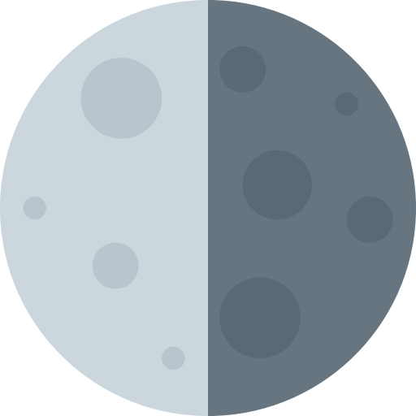

## lunasvg
lunasvg is a standalone c++ library to create, animate, manipulate and render SVG files.



## example
```cpp
#include <lunasvg/svgdocument.h>

using namespace lunasvg;

int main()
{
    SVGDocument document;
    document.loadFromFile("tiger.svg");
    
    Bitmap bitmap = document.renderToBitmap();
    
    // do something useful with the bitmap.
    
    return 0;
}

```

## features
- Basic Shapes : rect, circle, ellipse, line, polyline, polygon, path.
- Paint Servers : solidColor, linearGradient, radialGradient, pattern.
- Clipping, Masking and Compositing : clipPath, mask, group opacity.
- Document Structures: defs, svg, g, use, symbol.
- Coordinate Systems, Transformations and Units.
- Markers.
- Texts.
- Animations (TODO) : animate, animateColor, animateMotion, animateTransform.

## build

Just run premake5 on main directory

## support
If you like the work lunasvg is doing please consider a small donation:

<a href="https://www.buymeacoffee.com/sammycage" target="_blank"></a>
